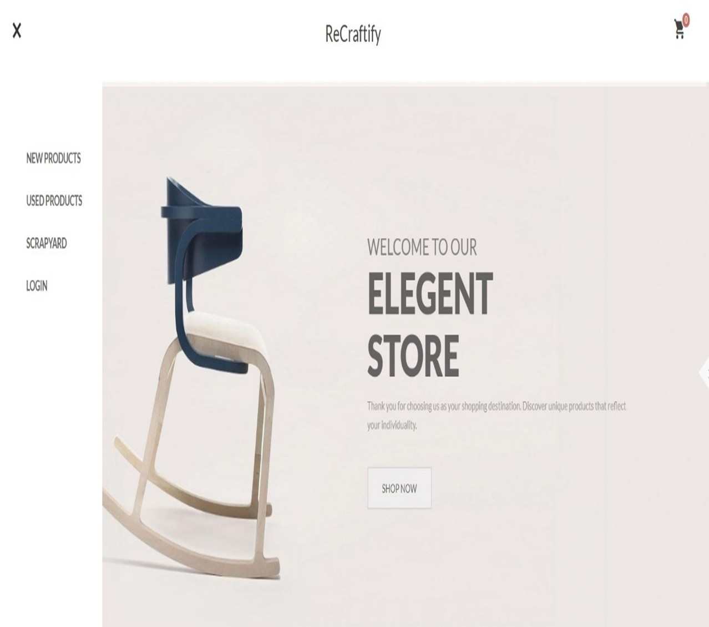
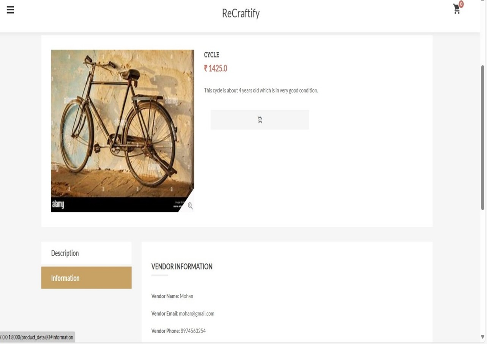
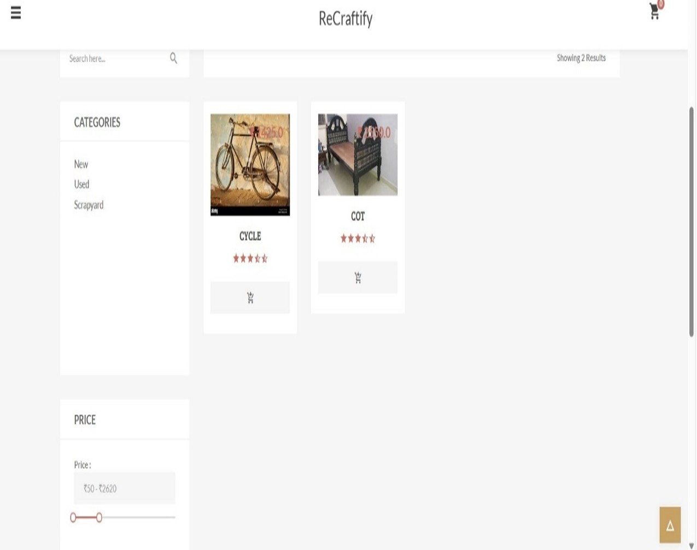
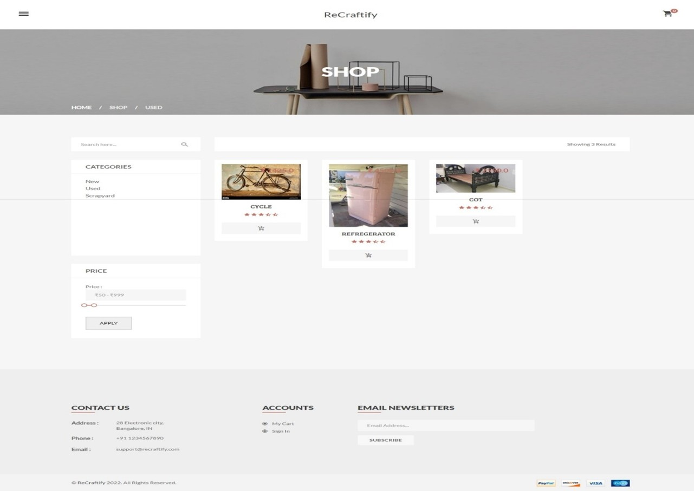
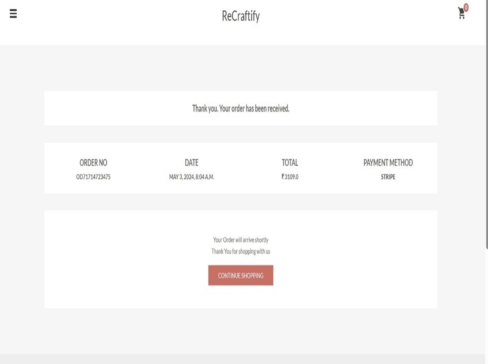
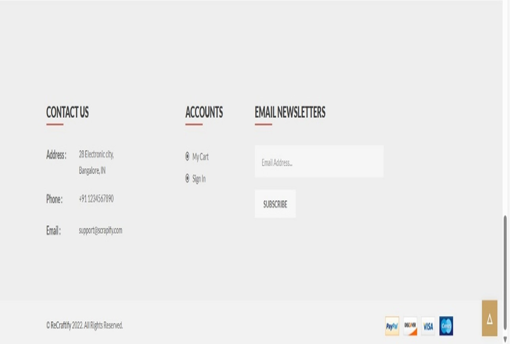
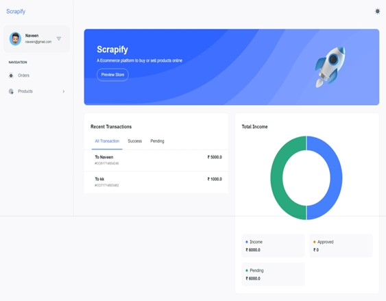
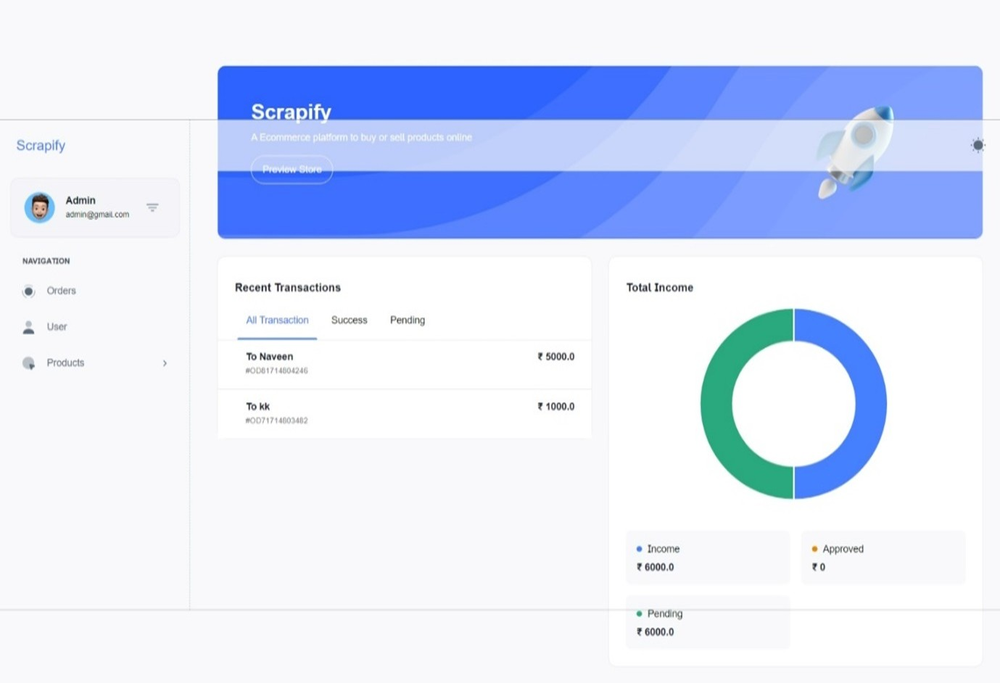

# ReCraftify 🛍️

**ReCraftify** is a full-stack online classified platform built with Django. It provides a modern platform for managing and showcasing handcrafted or curated products. The application supports both vendor and admin roles with dynamic product management, secure user authentication, and an intuitive store front interface.

---

## 🔧 Tech Stack

- **Backend**: Django 5.1.5 (Python)
- **Frontend**: HTML5, CSS3, Bootstrap 5, JavaScript
- **Database**: SQLite3 (development) — easily swappable with PostgreSQL or MySQL
- **Version Control**: Git & GitHub

---

## 🚀 Key Features

- 🔐 **User Authentication** (Login, Signup, Logout)
- 👥 **Role-Based Access**: Admin, Vendor, and Customer
- 🛍️ **Product Management** (Add, Update, Delete, Categorize)
- 🖼️ **Image Upload** with media handling
- 📊 **Vendor Dashboard** for order and product tracking
- 🌐 **Responsive UI** with Bootstrap for mobile/tablet/desktop
- ⚙️ **Admin Panel** for superuser-level control
- 📦 **Organized Modular App Structure** for maintainability

---

## 📁 Folder Structure

```
ReCraftify/
├── assets/
│   └── screenshots/        # Project screenshots for README
├── dashboard/              # Admin dashboards and controls
├── media/                  # Uploaded user/vendor media
├── member/                 # Customer and user-related features
├── scrapify/               # Project settings, URLs, WSGI, ASGI
├── static/                 # Static assets (CSS, JS, etc.)
├── store/                  # Core store logic (models, views, products)
├── store_front/            # Public-facing store pages
├── vendor/                 # Vendor-specific views and tools
├── manage.py               # Django’s command-line utility
├── requirements.txt        # Python dependencies
└── scrapify_db.sqlite3     # Development database
```

---

## ⚙️ Getting Started

### ✅ 1. Clone the Repository

```bash
git clone https://github.com/Nagaprasad-77/ReCraftify.git
cd ReCraftify
```

### ✅ 2. Create and Activate Virtual Environment

```bash
# Windows
python -m venv env
env\Scripts\activate

# Linux/macOS
python3 -m venv env
source env/bin/activate
```

### ✅ 3. Install Dependencies

```bash
pip install -r requirements.txt
```

### ✅ 4. Run Migrations & Start Server

```bash
python manage.py makemigrations
python manage.py migrate
python manage.py runserver
```

Now open your browser and go to:  
👉 [http://127.0.0.1:8000](http://127.0.0.1:8000)

---

## 🧪 Sample Admin Access

```
Username: admin@gmail.com  
Password: Admin@12
```

> ⚠️ Replace with your actual superuser credentials or create one:

```bash
python manage.py createsuperuser
```

---

## 📸 Screenshots

### 🏬 Storefront Page  


### 📚 Sidebar Navigation  


### 📄 Product Detail Page  


### 🔐 Registration & Login  


### 🔍 Search & Filter  


### 🧾 Product Listings Page  


### 🛒 Shopping Cart Page  


### 💳 Billing Section  


### ✅ Successful Payment & Order  


### 📞 Footer Section  


### 🧑‍💼 Vendor Dashboard  


### 🛠️ Admin Dashboard  


---

## 📌 Future Enhancements

- 🔄 API integration with Django REST Framework
- 💳 Payment Gateway Integration (Razorpay/Stripe)
- 📈 Sales & Order analytics dashboards
- ✉️ Email Notifications (SMTP)
- 🔍 Search and filtering enhancements

---

## 👨‍💻 Author

**Nagaprasad Devadiga**  
📍 India  
🔗 [GitHub Profile](https://github.com/Nagaprasad-77)

---

## 📜 License

This project is licensed under the **MIT License** — feel free to use and modify.

---